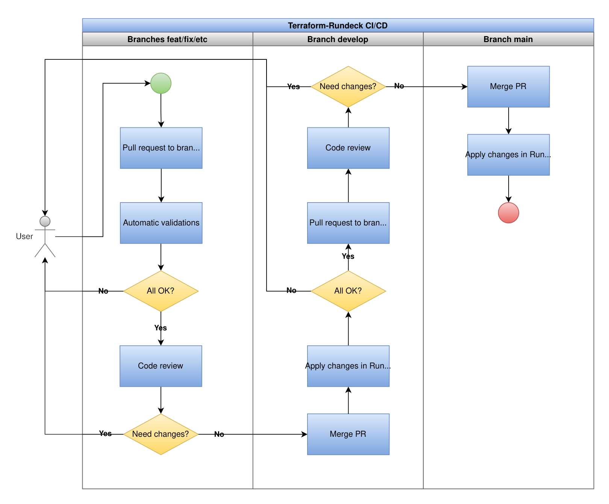
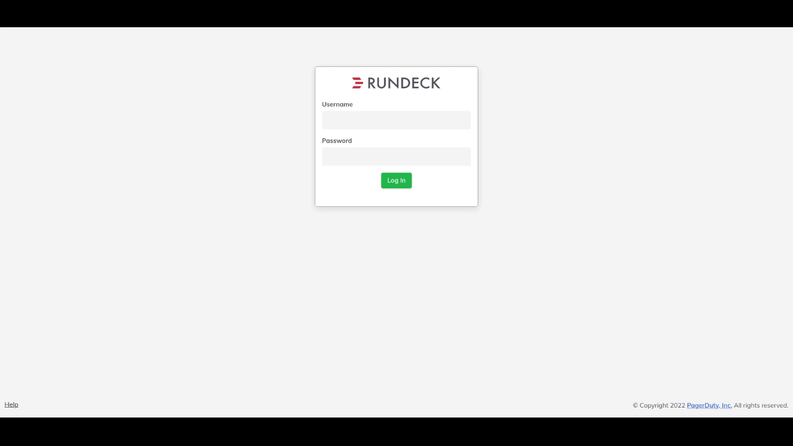
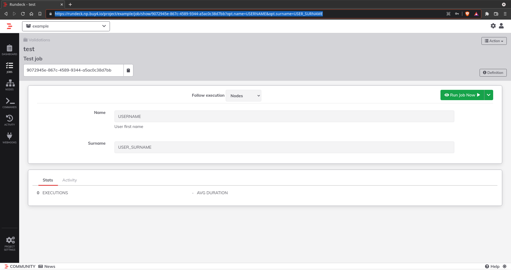

Terraform-Rundeck
=================

The purpose of the project is providing Rundeck as GitOps, managing projects and jobs through Terraform.

This project aims to abstract the Rundeck web user interface adding the possibility for users to create and manage projects and jobs in Rundeck with code, but It's not necessary to know how to code or understand Terraform, users only need to create a project dir and fill a Terraform vars file (tfvars) with the necessary data.

Project Structure
-----------------

```sh
.
|-- azure-pipelines
|   |-- vars
|   |   |-- nprod.yml
|   |   `-- prod.yml
|   `-- azure-pipelines.yml
|-- images
|   |-- pipeline-flowchart.png
|   `-- terraform-rundeck-ci-cd.png
|-- projects
|   |-- example
|   |   |-- acls
|   |   |   `-- project_example.aclpolicy
|   |   |-- inventory
|   |   |   |-- ansible
|   |   |   |   `-- hosts
|   |   |   `-- resources.yaml
|   |   |-- jobs
            |-- options
|       |   |   `-- region_foods
|       |   |       |-- Brazil.json
|       |   |       |-- -.json
|       |   |       |-- Mexico.json
|       |   |       `-- USA.json
|   |   |   `-- test.tfvars
|   |   |-- playbooks
|   |   |   `-- playbook.yml
|   |   |-- scripts
|   |   |   `-- test.sh
|   |   |-- ansible.cfg
|   |   `-- requirements.yml
|-- scripts
|   |-- terraform_destroy.sh
|   `-- terraform_plan_apply.sh
|-- main.tf
|-- provider.tf
`-- variables.tf
```

**azure-pipelines:** Directory with azure-pipelines definitions

**projects:** Home for Rundeck Projects definitions

**main.tf:** Main Terraform file for managing Rundeck resources

**provider.tf:** Terraform Rundeck provider configurations

**variables.tf:** Project variables definitions

To create a new project you can simple copy files from `example` project and modify as needed.

The project structure consists of:

 - **project directory:** The name of the directory will be the name of the project in Rundeck
 - **acls:** Rundeck project and jobs access control policy files. The `name` of the file will represents the name of the policy and must have the extension `.aclpolicy`. See more in [Rundeck ACLs Doc](https://docs.rundeck.com/docs/administration/security/authorization.html#access-control-policy-2).
 - **inventory:** Rundeck nodes definitions. The `nodes` in Rundeck represents the target hosts where the jobs will be executed. The inventory can be defined as yaml, xml or json files as specified in the [documentation](https://docs.rundeck.com/docs/administration/projects/resource-model-sources/builtin.html#resource-format-plugins). It can also be defined as Ansible inventory that could be declared in `projects/project_name/inventory/ansible` folder.
 - **jobs:** Here lives the Rundeck Jobs definitions as Terraform `tfvars` files.
 - **any**: Any other folders or files listed insided the project structure will be copied to the Rundeck host so they could be referenced with the path `/projects/project_name/....`. Example: `/projects/example/playbooks/test.yml`.

Create Jobs
-----------

To create a job you need to define a Terraform `.tfvars` file  in the folder `projects/project_name/jobs`.

Below is a list of possible variables to define in the job .tfvars file.

:warning: At last one `job_workflow_...` option is required.

| Variable | Options | Description |
| -------- | ------- | ----------- |
| job_group_name (**required**) | | Job group name for organization |
| job_name (**required**) | | The job name |
| job_description (**optional**) | **Default:** "" | The job description |
| job_node_filter_query (**optional**) | **Default:** rundeck server | Filter nodes where the jobs will be executed. See more at [Rundeck Node Filters Doc](https://docs.rundeck.com/docs/manual/11-node-filters.html#node-filter-syntax) |
| job_log_level (**optional**) | **Default:** INFO | The job log level verbosity |
| job_schedule (**optional**) | | Schedule job with Linux Cronjob format |
| job_allow_concurrent_executions (**optional**) | **Default:** true | Allow concurrent job executions |
| job_preserve_options_order (**optional**) | **Default:** true | Preserve the job options order |
| job_global_log_filter (**optional**) | **Default:** [] | Job global log filter expression. Know more about the options in [variables.tf](./variables.tf). See [Rundeck Log Filters Doc](https://docs.rundeck.com/docs/manual/log-filters/). Example: [projects/example/jobs/test.tfvars](projects/example/jobs/test.tfvars) |
| job_options (**optional**) | **Default:** [] | Job input options. Know more about the options in variables.tf. See [Rundeck Job Options Doc](https://docs.rundeck.com/docs/manual/job-options.html#prompting-the-user). |
| job_workflow_inline_script (**optional**) | **Default:** [] | Job workflow where the code is declared direct within the job definition. Example: [projects/example/jobs/test.tfvars](projects/example/jobs/test.tfvars) |
| job_workflow_script_file (**optional**) | **Default:** [] | Job workflow where the code is defined in a script file. Example: [projects/example/jobs/test.tfvars](projects/example/jobs/test.tfvars) |
| job_workflow_ansible_inline (**optional**) | **Default:** [] | Job workflow where the Ansible Playbook code is declared direct within the job definition. Know more about the options in [variables.tf](./variables.tf). Example: [projects/example/jobs/test.tfvars](projects/example/jobs/test.tfvars) |
| job_workflow_ansible_playbook (**optional**) | **Default:** [] | Same as `job_workflow_ansible_inline` option, but the Ansible code must be defined in a YAML file |
| job_workflow_node_ansible_inline (**optional**) | **Default:** [] | Job workflow where the Ansible Playbook code is declared direct within the job definition, and a Ansible inventory must be declared in a `ansible.cfg` so the user could select the target nodes to execute the job |
| job_workflow_node_ansible_playbook (**optional**) | **Default:** [] | Same as `job_workflow_node_ansible_inline` option, but the Ansible code must be defined in a YAML file |
| job_workflow_strategy (**optional**) | `node-first` (default), `step-first` or `parallel` | Controls the order of execution of steps and command dispatch to nodes: Node-oriented and Step-oriented. See more at [Rundeck Job Workflow Doc](https://docs.rundeck.com/docs/manual/job-workflows.html#job-workflows) |
| job_workflow_max_thread_count | **Default:** 1 | The maximum number of threads to use to execute the job, which controls on how many nodes the commands can be run simulateneously. `1` means that the commands will be run sequentially |
| job_workflow_continue_next_node_on_error | **Default:** false | Continue to run subsequent nodes if even if a node fails |
| job_notifications_email (**optional**) | **Default:** [] | Job notifications configuration using the email type. Know more about the options in [variables.tf](./variables.tf) Example: [projects/example/jobs/test.tfvars](projects/example/jobs/test.tfvars) |
| job_notifications_webhook (**optional**) | **Default:** [] | Job notifications configuration using the webhooks type. Know more about the options in [variables.tf](./variables.tf) Example: [projects/example/jobs/test.tfvars](projects/example/jobs/test.tfvars) |
| job_notifications_plugin (**optional**) | **Default:** [] | Job notifications configuration using the plugin type. Know more about the options in [variables.tf](./variables.tf) Example: [projects/example/jobs/test.tfvars](projects/example/jobs/test.tfvars) |

How the pipeline works
----------------------

To provides the best experience for the users with the minimum knowledge about Terraform, the project uses the [**Terraform Workspaces**](https://www.terraform.io/docs/language/state/workspaces.html) feature, so each job has his own state generated inside his own workspace.

Below is the process that the user must do to have his/her job applied into Rundeck:

* First, the user make his changes in a **feat/fix/docs…etc** branch and push that branch to the repo
* Then, the user should open a Pull Request to the **develop branch**. After that, the pipeline will be triggered to validate the user code doing a **terraform validate** and **terraform plan** commands
* If all the validations passing successfully, the code must be reviewed by the maintainers and, if it’s all right, the code will be approved and will be merged into the develop branch. The merge will trigger the pipeline again but now to do a terraform apply command to apply the changes into Rundeck Staging instance. If the code is reproved, the user must make the necessary changes and push the fixes to the same branch as before
* After validations in Rundeck Staging, the user should make a new Pull Request, now from **develop branch** to the **main branch**
* Again, the code will be reviewed and if it’s all right, that will be merged into main branch and the changes will be applied to Rundeck Prod instance, else the user will be notified about changes that must be made before the changes could be applied in production.



Consuming the jobs
------------------

Rundeck provides two main ways for access and consume the jobs, first Rundeck provides a web interface where the user can navigate through the projects and use the jobs available, second is the capability of run any job permitted through REST API calls.

Each job created in Rundeck has a UUID that can be obtained accessing the job on Rundeck web interface, or through the [List Jobs API endpoint](https://docs.rundeck.com/docs/api/rundeck-api.html#listing-jobs):



With the job UUID in hands, Rundeck provides the possibility to [share a job URL](https://docs.rundeck.com/docs/manual/job-options.html#linking-to-jobs-and-providing-option-values) with it’s options and values giving the user the job page auto-filled:

```
https://rundeck-staging.org/project/example/job/show/9072945e-867c-4589-9344-a5ac0c38d7bb?opt.name=USERNAME&opt.surname=USER_SURNAME
```


Another way to execute a job is doing a REST API call on [Rundeck Job Endpoint](https://docs.rundeck.com/docs/api/rundeck-api.html#running-a-job):
```sh
# Run a Job
curl -L -X POST 'https://runddeck-staging.org/api/40/job/9072945e-867c-4589-9344-a5ac0c38d7bb/run'  \
-H 'Accept: application/json' \
-H 'Content-Type: application/json' \
-H 'X-Rundeck-Auth-Token: RUNDECK_USER_TOKEN' \
-d '{
    "options": {
        "name": "YOUR_NAME",
        "email": "YOUR_EMAIL",
    }
}'

# Get job status and output
curl -L -X GET 'https://runddeck-staging.org/api/40/execution/EXECUTION_ID/output?compacted=true' \
-H 'Accept: application/json' \
-H 'Content-Type: application/json' \
-H 'X-Rundeck-Auth-Token: RUNDECK_USER_TOKEN'
```

And, to abstract the complexity of REST API calls  and facilitates the integration with other already existing automations, for example, there is the option to use Ansible for execute Rundeck jobs.

First the Ansible collection community.general version >= 3.8.0 need to be installed:
```
ansible-galaxy collection install community.general
```

Then, the [rundeck_job_run](https://docs.ansible.com/ansible/latest/collections/community/general/rundeck_job_run_module.html#ansible-collections-community-general-rundeck-job-run-module) module could be used:
```yaml
- name: Run a Rundeck job with options
  community.general.rundeck_job_run:
    url: https://runddeck-staging.org
    api_version: 40
    api_token: USER_TOKEN
    job_id: 9072945e-867c-4589-9344-a5ac0c38d7bb
    job_options:
        name: YOUR_NAME
        email: YOUR_EMAIL
  register: rundeck_job_run

- name: Show execution info
  ansible.builtin.debug:
    var: rundeck_job_run.execution_info
```

References
----------
* [Rundeck Docs](https://docs.rundeck.com/docs/)
* [Rundeck Projects Docs](https://docs.rundeck.com/docs/administration/projects/)
* [Rundeck Jobs Docs](https://docs.rundeck.com/docs/manual/04-jobs.html)
* [Rundeck API Postman Collection](https://documenter.getpostman.com/view/95797/rundeck/7TNfX9k)
